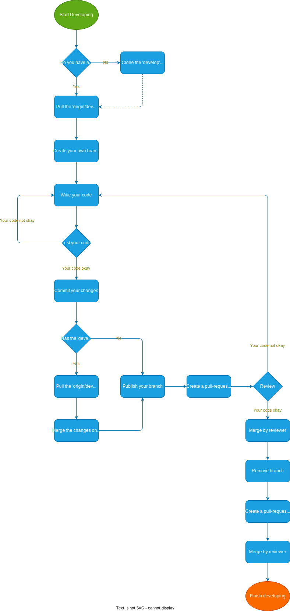

# ATMI Plus-Minus App

This is the main repository for the development of ATMI Plus-Minus App.

## Requirements
This app is created using Laravel 11. Technologies needed are as follows:
- PHP version 8.2 or higher
- Composer version 2.4 or higher
- Node.js version 14 or higher
- MySQL or MariaDB

## Branches
There are 2 branches which are used in the development process.
1. `main`

    The `main` branch is the production branch which is regularly tested and deployed. The changes in the `main` branch are the result of pull requests on the `develop` branch.

2. `develop`

    The `develop` branch is used mainly for the development. Developer should clone this branch and then create his own branch to develop some new features, fix some bugs, etc.

## Workflow
The development workflow is as follows:

## CI/CD
The development utilizes GitHub Actions to reduce downtime. Both continuous integration (CI) and continuous deployment (CD) are configured in their owns workflows.
### Setup Development Environment
- Get your PHP ready!
- Get your database ready!
- Clone `develop-branch` in to your local repository.
- Navigate into app directory.
- Run `composer install` to install all dependencies.
- Provide `.env` file in the root directory. If key is needed, generate using `php artisan key:generate`.
- Run `php artisan migrate:refresh --seed`.
- Run `php artisan serve` or use Herd or Valet to host the application.

